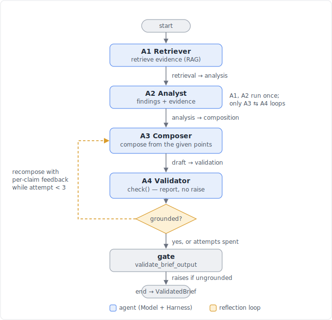

# Pipeline graph

The pipeline is a LangGraph `StateGraph` of four agents joined by explicit Context
Translation edges, with a reflection loop between the Composer (A3) and the Validator
(A4). A request enters at `start` and leaves as a `ValidatedBrief` — or the run raises
if the content cannot be grounded.

## Nodes

| Node         | Role                             | Output contract           |
| ------------ | -------------------------------- | ------------------------- |
| A1 Retriever | RAG retrieval                    | `RetrievalBundle`         |
| A2 Analyst   | evidence-bound findings          | `AnalysisReport`          |
| A3 Composer  | draft the deliverable            | `Draft`                   |
| A4 Validator | grounding / policy / format gate | `ValidatedBrief`          |
| gate         | terminal `validate_brief_output` | raises or passes to `end` |

Each agent is a Model + Harness pair running a Plan-Execute loop. Every edge is a typed
Pydantic contract translated in code (never natural language): `retrieval → analysis`,
`analysis → composition`, `draft → validation`.

## The reflection loop (A3 ⇄ A4)

A prompt alone cannot make the LLM composer perfectly faithful — it sometimes elaborates
beyond the points it was given, and A4's semantic grounding check correctly rejects the
unfaithful sections. The loop is the Harness-level fix (ADD Reflection topology:
generator A3 + critic A4):

1. `composer_node` runs A3 with the current `feedback` (empty on the first pass).
2. `validator_node` runs `A4.check()` — the **report** mode: it computes the checks and
   returns the brief plus the claim texts the verifier judged unsupported, **without
   raising**.
3. The conditional edge routes: if the brief is grounded, or `attempt >= 3`, go to the
   `gate`; otherwise loop back to A3 with the unsupported claims as `feedback`.
4. `gate` runs `validate_brief_output`, which raises `GROUNDING_FAILED` (or
   `POLICY_FAILED` / `FORMAT_FAILED`) if any check still fails, else passes to `end`.

A1 and A2 run once; only A3 ⇄ A4 iterate. State carried around the loop: `feedback`
(unsupported claim texts) and `attempt` (the compose count, capped by
`MAX_COMPOSE_ATTEMPTS = 3`).

The loop raises reliability without weakening the gate — a brief only reaches `end` when
it is genuinely grounded. `SOURCE_UNRESOLVED` (a cited source missing from the store) is
not a loop path: it raises immediately from `check()`, since recomposing cannot fix a
missing document.

## See also

- [DESIGN.md](../../DESIGN.md) — the full Agent-Driven Design of the system.
- [Reflection loop design spec](../superpowers/specs/2026-07-05-reflection-loop-design.md).
